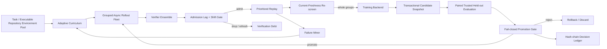

# Architecture

VARE owns the outer capability-improvement control plane. It intentionally does not own distributed tensor training, model serving, or checkpoint transport. Those remain in backends such as Recursive-Verification-Lag, verl, vLLM, SGLang, or a lab-internal stack.

## Invariants

1. **Optimization and promotion evidence are separated.** A proxy verifier may train the candidate; promotion uses independent held-out evidence.
2. **Policy and verifier versions are first-class.** Freshness is checked both when experience enters replay and again immediately before training.
3. **Group-relative objectives preserve group identity.** GRPO comparison groups receive a unique rollout-group ID and prioritized replay samples whole groups, even when this slightly exceeds a nominal batch budget.
4. **Candidate weights are transactional.** Training may mutate a shared model only behind a snapshot/restore boundary; the active champion does not change until promotion succeeds.
5. **Concurrent rollout provenance is unique.** Sequence IDs/seeds are allocated before the first async yield.
6. **Verifier disagreement and distribution shift are observable control signals.**
7. **Negative results survive.** Rejections and null/negative outcomes remain in append-only evidence.
8. **Experiment claims can be preregistered.** Protocol locks are content-addressed before results are observed.

## Engineering environment layer

`vare.environments` adds repository-level tasks without moving learner ownership into VARE. A `TaskCatalog` selects immutable task specifications; `WorkspaceAgentRollout` materializes an isolated candidate checkout; `CatalogEnvironmentVerifier` evaluates the resulting workspace using trusted command vectors and returns a normal VARE `Verification`. This makes repository engineering trajectories first-class replay data while keeping the evaluator independent from agent text output.

The local runner is intentionally not advertised as a hostile-code sandbox. Open-ended untrusted agents require an external container/VM boundary with evaluator assets mounted read-only.
