# Evaluation execution contract

## Correctness question

Can a bounded evaluation campaign distinguish a rejected candidate from a broken evaluation, bind every accepted score to the exact inputs it observed, and retain enough evidence to audit those decisions? The baseline for scheduling measurements is this same runner with one worker. VARE does not compare against an uninstrumented subprocess launcher.

## Architecture

`python3 -m vare` uses only the standard library and requires Python >=3.9, Git, and POSIX process groups. `src/vare/runner.py` contains the implementation; `tests/test_runner.py` contains local, network-free regression fixtures.

```mermaid
flowchart LR
    Plan[Fixed job plan] --> Queue[Bounded async queue]
    Queue --> Lock[Validate protected protocol]
    Lock --> Before[Fingerprint candidate]
    Before --> Child[Isolated process group]
    Child --> Bound[Deadline and bounded output]
    Bound --> After[Recheck inputs]
    After --> Contract[Validate JSON and provenance]
    Contract --> Record[Atomic raw records]
    Record --> Ledger[Hash linked journal]
    Ledger --> Audit[Manifest and consistency audit]
```



A job contains a safe unique ID, a task directory in the trusted repository, an external Git workspace, a deadline, and an output limit. Paths in a CLI plan are relative to the plan file. The grader path comes from the locked task descriptor. The CLI does not accept arbitrary shell commands. The Python API accepts an explicit trusted root for test fixtures.

The runner snapshots protected inputs before launch, checks descriptor/brief/grader hashes against the versioned lock, fingerprints candidate HEAD, source-file bytes and binary Git diff against the task base, and starts the grader in its own POSIX session. A semaphore bounds active jobs. Timers are monotonic. Queue time ends when a worker starts input validation; execution time includes validation, grading and revalidation. Campaign wall time includes job record and journal writes, and excludes initial snapshots and source fetch.

Stdout and stderr share a byte budget. Excess output triggers process-group termination; retained bytes never exceed the budget. The deadline includes inherited-pipe draining. The original process group is killed on normal completion, timeout, cancellation and output overflow. If a descendant inherits a pipe and outlives its parent, the evaluation times out. This deliberately rejects incomplete subprocess cleanup even if the parent printed a passing JSON object.

After execution, the runner recomputes the protected protocol and candidate fingerprints. A changed observed input cannot count as success. JSON parsing rejects duplicate keys and nonfinite numbers. A valid result needs the expected schema, exact task/revision/diff/source/evaluator/descriptor provenance, checks, Boolean score and failures. Success requires exit 0 and no failures; candidate rejection requires exit 2 and nonempty failures. Infrastructure failures have separate statuses.

## Evidence persistence

Each completed job has raw stdout/stderr, a parsed grader object when available, and an atomic record. SHA-256 links terminal journal entries to record bytes and the previous entry. The journal is atomically replaced after each job; its write cost grows with campaign size. A final manifest covers the exact file set. Catchable cancellation retains committed records and an interrupted summary; jobs still queued may have no terminal record. An uncatchable process kill or machine crash can leave an incomplete bundle without a final manifest. Existing output directories are refused.

`python3 -m vare audit BUNDLE` verifies file hashes/set, the journal chain, record/stream bindings, protected snapshots, accepted grader contracts and summary counts. This checks integrity and internal consistency against a reviewed bundle. A party able to rewrite all files, hashes and the Git trust anchor can forge another consistent bundle. Hashes are not signatures.

## Run a campaign

Prepare an external candidate with `scripts/prepare_task.py`, then save a plan such as:

```json
{
  "jobs": [
    {
      "id": "rvl-candidate",
      "task_root": "/absolute/path/to/VARE/benchmarks/historical/rvl_behavior_policy_parity",
      "workspace": "/tmp/vare-rvl-candidate",
      "timeout_seconds": 30,
      "output_limit_bytes": 1048576
    }
  ]
}
```

```bash
python3 -m vare run --plan /tmp/vare-plan.json --output /tmp/vare-campaign --workers 4
python3 -m vare audit /tmp/vare-campaign
python3 -m unittest discover -s tests -v
```

The `run` exit code is 0 when all jobs were evaluated as valid passes or valid candidate rejections. It is 1 if any evaluation has an operational error. Individual scores are in the records; do not treat campaign exit 0 as all candidates passing. `audit` exit 0 confirms retained consistency, including bundles containing operational failures.

## Boundaries

This is a local evaluation control plane, not a security sandbox or a distributed scheduler. Trusted candidate code can import and execute Python. A malicious process could escape its group, alter unlisted files, race the before/after snapshots or temporarily modify and restore inputs. CPU, RSS, disk and network are not OS-limited. Git commands have a 10-second timeout; source files and protected assets have a 16 MiB per-file ceiling. Source provenance covers the task's declared file list, not every imported dependency. Do not run untrusted candidates on a personal machine.

The original `run` command has no retries or resume; its interrupted bundles are evidence snapshots. The [durable commands](recovery.md) add separate live-state recovery while reusing this grader execution contract. Neither path provides a distributed fleet or measures model/API inference, training or promotion. The original scheduler report applies to the code frozen in its retained snapshots.
