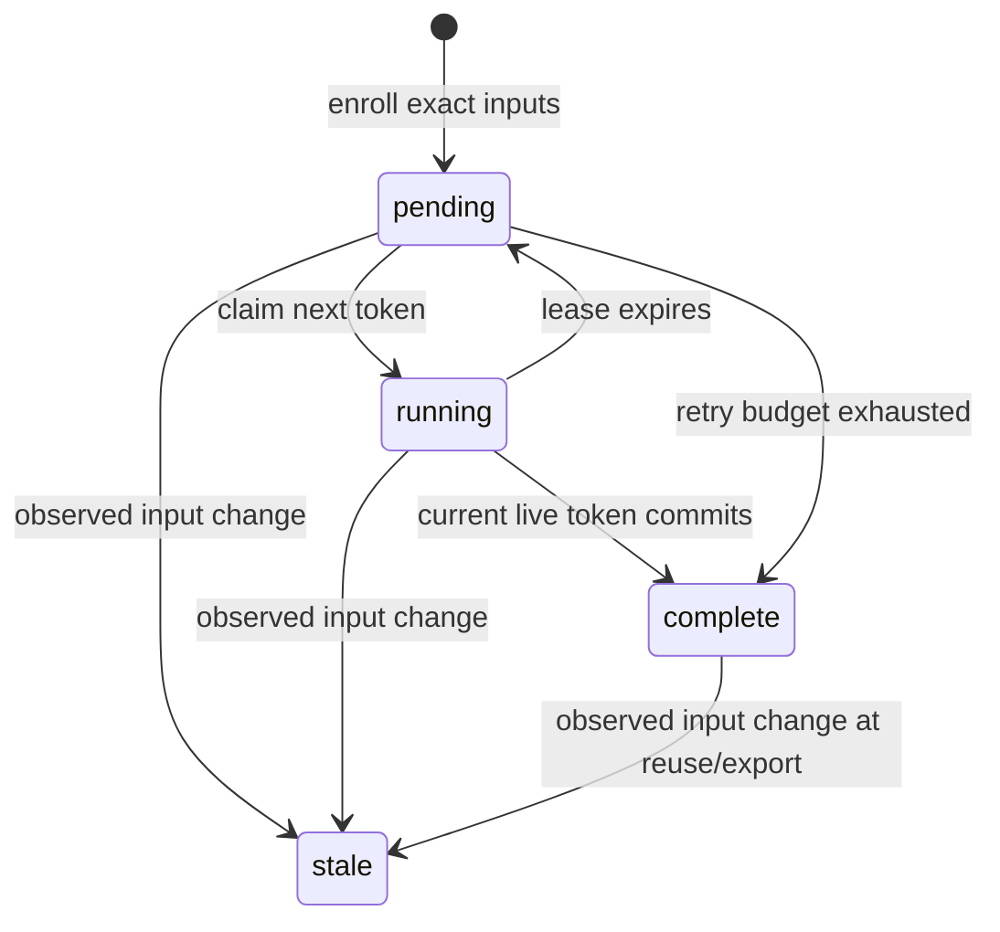

# Durable local evaluation contract

## Why this layer exists

The original `run` command retains a bounded campaign but cannot resume after its coordinator dies. The durable commands reuse its locked grader execution and add transactional job ownership, recovery and effective-result freshness. This is the local state boundary for evaluations; experimental model controls and legacy workspace-agent campaigns remain separate consumers. No learning or promotion outcome is inferred from a completed historical calibration.

## State machine



An attempt has its own state: claimed, expired, committed or fenced. Job completion and an attempt record/event are written in one SQLite transaction. A late attempt may be retained as fenced, but cannot change a newer effective decision. Repeated identical publication returns the earlier attempt identity; a different payload for a terminal attempt is rejected. Historical attempt status and current effective status are distinct: an old pass can remain in the record while the job becomes `input_stale`.

SQLite serializes writers; `BEGIN IMMEDIATE` takes the write transaction before selecting work. See the [official isolation documentation](https://www.sqlite.org/isolation.html) and [transaction reference](https://www.sqlite.org/lang_transaction.html). Connections use WAL on a local filesystem and `synchronous=FULL`. Each mutation uses a new connection; a process death before commit rolls back its transaction. WAL does not provide distributed consensus. Machine power-loss and filesystem durability have not been experimentally validated here.

A claim contains job ID, owner label, increasing token and a wall-clock lease deadline. Completion checks the persisted job specification/enrollment, token, owner, running state and unexpired deadline inside the transaction. Caller-supplied input metadata cannot replace stored enrollment. Heartbeats extend a live lease; expiry cannot be renewed. Expired work may execute again, up to the declared maximum attempts. Timeout or a valid candidate rejection is terminal rather than automatically retried.

Freshness recomputes the locked protocol and candidate fingerprint before worker use, completion and export. Changed or unreadable inputs invalidate the entire enrolled job; they are not silently accepted as a new candidate. Start another state file to evaluate new inputs. Export captures a consistent database read transaction, strips live workspace paths and includes protected snapshots, raw attempts, events and an exact-file-set manifest. The auditor replays permissible transitions and validates accepted payloads against enrollment and snapshots. Hashes provide consistency relative to a reviewed bundle, not signatures or authentication.

## Commands

Use the same plan format as the [bounded runner](execution.md). Keep live state outside the VARE checkout; it contains local absolute paths. For example:

```bash
python3 -m vare durable-init --plan /tmp/vare-plan.json --state /tmp/vare-state.db --max-attempts 3
python3 -m vare durable-work --state /tmp/vare-state.db --workers 4 --lease-seconds 5
# After a process failure, run durable-work again with the same state.
python3 -m vare durable-export --state /tmp/vare-state.db --output /tmp/vare-durable-evidence
python3 -m vare durable-audit /tmp/vare-durable-evidence
```

Enrollment requires valid locked assets and a readable Git candidate. The state file must be new. Each export directory must be new; exports are snapshots, so partial and later complete evidence can both be retained. `durable-work` returns 0 only when all effective outcomes are valid candidate passes/rejections; stale inputs, exhaustion or operational failure produce exit 1. An audit returns 0 for a consistent bundle including operational failures or incomplete work; inspect its outcomes and current states.

The full installed package/control-loop commands require Python >=3.11. Standalone checkout evaluation commands use Python >=3.9 and only standard-library modules. The root `vare/` directory is a bootstrap path; all implementation lives under `src/vare`.

## Safety and liveness limits

- Execution is at least once. This is deduplicated terminal publication, not exactly-once execution or external side effects.
- Owner labels are diagnostic identities, not authenticated principals. The live database and trusted root must be protected by the operator.
- Lease time is wall-clock time shared on one host. Clock movement can delay or accelerate recovery; this design has no cross-host clock model.
- Source validation is outside the database transaction. A malicious writer can race checks or change and restore files; sources must remain stable under trusted ownership.
- Killing a worker uncatchably while its grader is running can leave an orphan process group. Fencing prevents stale publication but does not contain that process or undo its side effects. The frozen crash experiments kill before grader launch or after commit.
- Workers rely on local filesystem locking and SQLite, not a network filesystem. Lease expiration permits replacement after worker loss; it does not prove service availability under resource exhaustion.
- The live database has no schema migration or automatic data repair. A failed creation can leave an unusable state file; retain it for diagnosis and use a fresh path.
- Exports are consistency evidence, not resumable databases. Resume uses the private live state. Disk, RSS, total process CPU and network are not bounded by this state layer.
